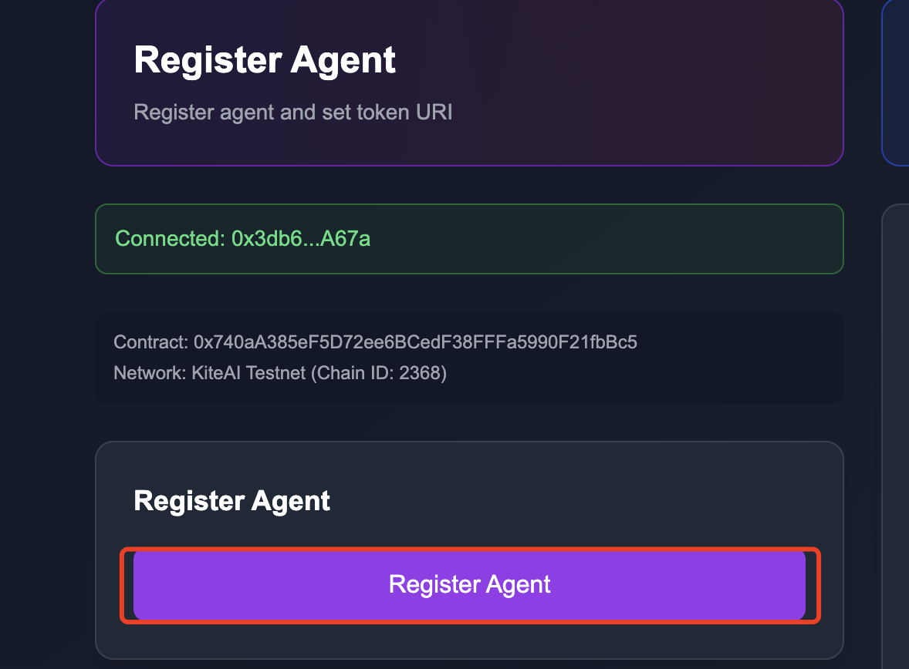
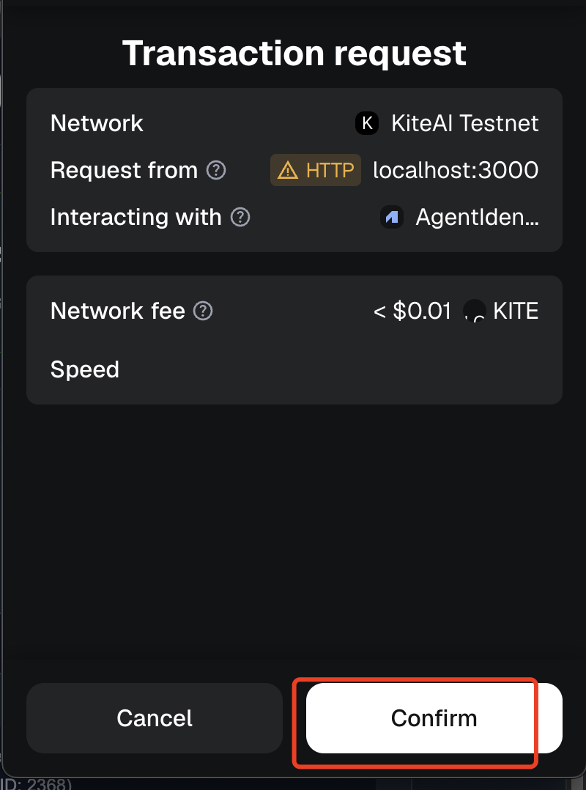
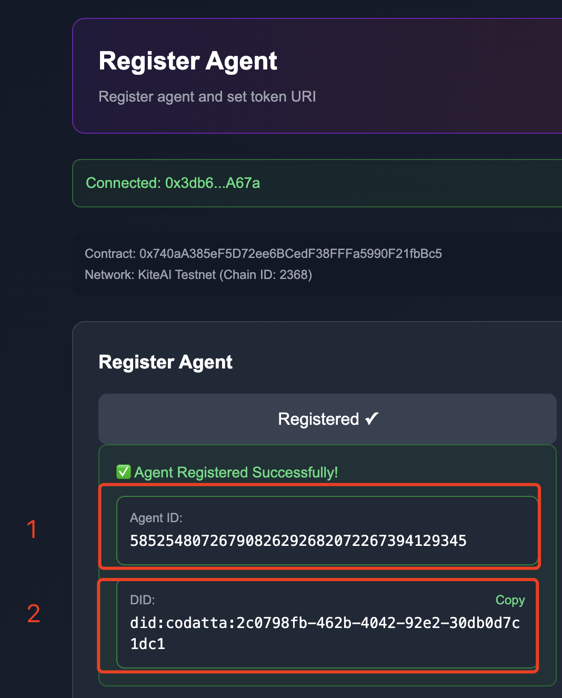
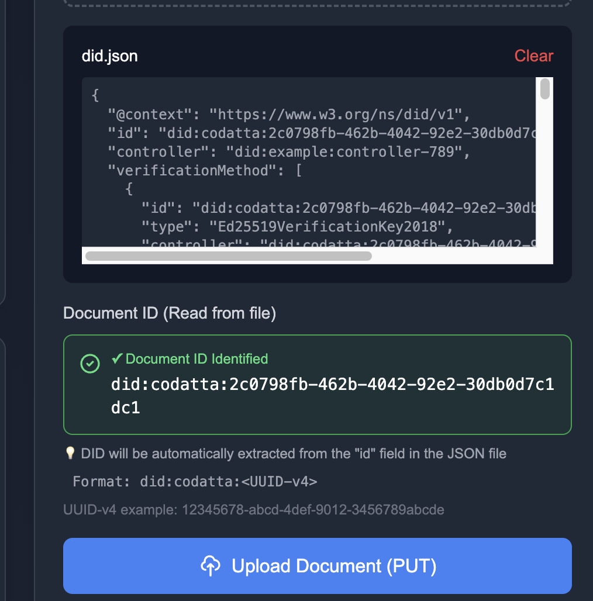
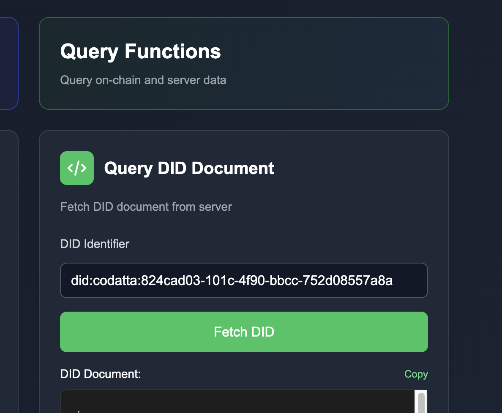

# DID Portal User Guide

Welcome to DID Portal! This guide will help you get started with creating and managing your decentralized identities.

## Overview

DID Portal provides a user-friendly interface for:
- **Registering Agents** - Create new DID identities on the blockchain
- **Uploading DID Documents** - Store your identity information
- **Querying DID Documents** - Retrieve and verify DID information

---

## Getting Started

### Prerequisites

Before you begin, make sure you have:
- ✅ An EVM-compatible wallet (MetaMask, etc.)
- ✅ Test tokens for gas fees (if on testnet)
- ✅ The DID Portal running at http://localhost:3000

---

## Step 1: Register a New Agent



### Instructions:

1. **Connect Your Wallet**
   - Click the "Connect Wallet" button in the top-right corner
   - Select your wallet provider (MetaMask, WalletConnect, etc.)
   - Approve the connection request

2. **Navigate to Register Agent**
   - Find the "Register Agent" section on the left side of the dashboard
   - Enter a Token URI for your agent (e.g., `https://example.com/token/1`)

3. **Submit Transaction**
   - Click "Register Agent"
   - Review the transaction details in your wallet popup



4. **Wait for Confirmation**
   - The transaction will be processed on the blockchain
   - You'll receive a receipt with your Agent ID and DID



**Important Information:**
- `Agent ID` - Your unique identifier stored in the smart contract
- `DID` - Your Decentralized Identifier (format: `did:codatta:<UUID>`)

---

## Step 2: Upload DID Document



### Prepare Your DID Document

Create a JSON file following the DID document standard. Here's an example:

```json
{
  "@context": [
    "https://www.w3.org/ns/did/v1",
    "https://w3id.org/security/suites/ed25519-2020/v1"
  ],
  "id": "did:codatta:12345678-abcd-4def-9012-3456789abcde",
  "verificationMethod": [
    {
      "id": "did:codatta:12345678-abcd-4def-9012-3456789abcde#keys-1",
      "type": "Ed25519VerificationKey2020",
      "controller": "did:codatta:12345678-abcd-4def-9012-3456789abcde",
      "publicKeyMultibase": "zH3C2AVvLMv6gmMNam3uVAjZpfkcJCwDwnZn6z3wXmqPV"
    }
  ],
  "authentication": [
    "did:codatta:12345678-abcd-4def-9012-3456789abcde#keys-1"
  ],
  "service": [
    {
      "id": "did:codatta:12345678-abcd-4def-9012-3456789abcde#service-1",
      "type": "MessagingService",
      "serviceEndpoint": "https://example.com/messages"
    }
  ]
}
```

You can find a sample DID document at `./public/docs-assets/did.json`.

### Upload Instructions:

1. **Locate Upload Section**
   - Find the "Upload Document" section in the center of the dashboard

2. **Select Your File**
   - Drag and drop your JSON file, or
   - Click to browse and select the file

3. **Verify DID**
   - The system will automatically extract the DID from the `id` field
   - Ensure the DID format is correct: `did:codatta:<UUID-v4>`

4. **Upload**
   - Click "Upload Document (PUT)"
   - Wait for the upload confirmation

**DID Format Requirements:**
- Must start with `did:codatta:`
- Followed by a valid UUID v4
- Example: `did:codatta:12345678-abcd-4def-9012-3456789abcde`

---

## Step 3: Query DID Document



### How to Query:

1. **Locate Query Section**
   - Find the "Query DID Document" section on the right side

2. **Enter DID**
   - Type or paste the DID you want to query
   - Format: `did:codatta:12345678-abcd-4def-9012-3456789abcde`

3. **Fetch Document**
   - Click "Fetch DID"
   - The system will retrieve the document from storage

4. **View Results**
   - The DID document will be displayed with syntax highlighting
   - Click "Copy" to copy the document to clipboard

---

## Troubleshooting

### Connection Issues

**Problem:** Cannot connect wallet
- Ensure your wallet extension is installed and unlocked
- Refresh the page and try again
- Check if you're on the correct network

**Problem:** Transaction fails
- Check if you have enough tokens for gas fees
- Verify the network is not congested
- Try increasing the gas limit

### Upload Issues

**Problem:** Invalid DID format
- Ensure your DID follows the format: `did:codatta:<UUID-v4>`
- The UUID must be a valid version 4 UUID
- Check that the `id` field exists in your JSON

**Problem:** Upload fails
- Verify your JSON file is valid
- Check that the updater service is running (port 3001)
- Review the error message for specific details

### Query Issues

**Problem:** DID not found
- Ensure the DID document was successfully uploaded
- Check that the resolver service is running (port 3002)
- Verify you're using the correct DID identifier

**Problem:** Service unavailable
- Check that all backend services are running
- Run `./test-services.sh` from the project root
- Review service logs in the `logs/` directory

---

## Service Configuration

The DID Portal connects to backend services:

- **Updater Service** (default: http://localhost:3001)
  - Handles DID document uploads
  - Configure via `NEXT_PUBLIC_UPDATER_URL` environment variable

- **Resolver Service** (default: http://localhost:3002)
  - Handles DID document queries
  - Configure via `NEXT_PUBLIC_RESOLVER_URL` environment variable

---

## Best Practices

1. **Security**
   - Never share your private keys
   - Always verify transaction details before signing
   - Keep your wallet software up to date

2. **DID Management**
   - Save your DID and Agent ID in a secure location
   - Back up your DID documents
   - Use descriptive service endpoints

3. **Document Updates**
   - You can update your DID document by uploading a new version with the same DID
   - Changes are reflected immediately after upload

---

## Additional Resources

- **DID Specification**: https://www.w3.org/TR/did-core/
- **ERC-8004 Standard**: https://eips.ethereum.org/EIPS/eip-8004
- **Project Repository**: [GitHub Link]

---

## Need Help?

If you encounter any issues or have questions:
- Check the troubleshooting section above
- Review the logs in `logs/` directory (for developers)
- Open an issue on the GitHub repository

---

**Last Updated**: December 2025

